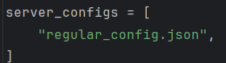

# Tests
Tu run the tests change the name of the configuration file in the `puppet-master.py` script to the name of the test and run the script

Don't forget to write strings as input in the client

## Test 1: "regular_config1.json"
- Tests the client changing the message after calculating the digital signature

The result is that nothing happens in the algorithm because the digital signature is wrong

## Test 2: "regular_config2.json"
- Tests leader sending a forged client append message

Message will be rejected and then lead to a round change, and they will reach consensus in the next round

## Test 3: "regular_config3.json"
- Tests the leader doing nothing

Will result in a round change

## Test 4: "regular_config4.json"
- Tests the leader doing nothing and next supposed leader has not received the client request

Will result in two round changes

## Test 5: "regular_config5.json"
- Tests sending a wrong prepare message

Nodes still reach consensus with the correct value

## Test 6: "regular_config6.json"
- Nodes don´t commit on the first round, but prepare the messages

Simulates a break of the network, will lead to a round change and then the nodes will commit using the prepare messages sent in the round change messages

## Test 7: "regular_config7.json"
- Only one of the nodes will not commit (node 4)

Will lead to that node sending round change messages and that other nodes will send their commit messages and the node will commit

## Test 8: "regular_config8.json"
- stress test (2 clients sending a bunch of checks, 100 each)

## Test 9: "regular_config9.json"
- stress test (2 clients sending a bunch of checks) with byzantine leader (node 4)

## Test 10: "regular_config10.json"
- stress test 2 clients sending 50/50 checks and transfers

## Test 11: "regular_config11.json"
- Node 2 changes the leader id of the block and re-does the digital signature (will not change the opinion of the other nodes and will reach consensus)
- If you want to see the frequencies of ignore in the quorum, turn on the print of the bucketlist in the messageBucket

## Test 12: "regular_config12.json"
- Node 4 does not wait for the previous instance to finish to start the next one. The other nodes will reject the message. 
When the first instance finishes, the nodes will do a round change and the next instance will be accepted
- Note: To perform this test, the blocksize must be set to 1 and the clients must send 2 operations in a row very quickly

## Test 13: "regular_config13.json"
- Client sends a transfer message with the wrong value and a byzantine leader working together with the client accepts it and starts the consensus
- The other nodes will reject the message in the pre-prepare

//LEMBRAR FAZER TEST 8 PARA TESTAR FAZER CONCORRENTE ENQUANTO UMA ANTERIOR VAI TER DE FAZER LEADER CHANGE
// matar 3 e fazer bue ex: 1:pppp 2:q ...8:u